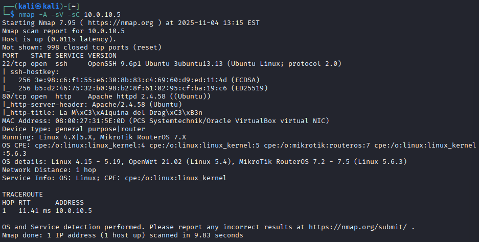
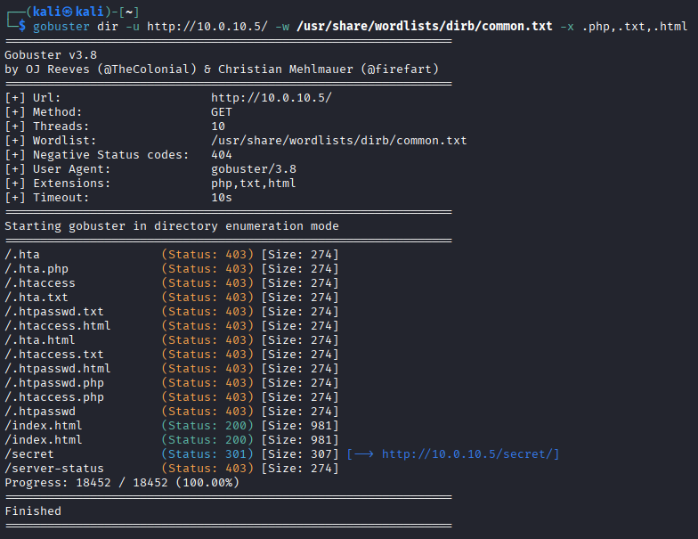
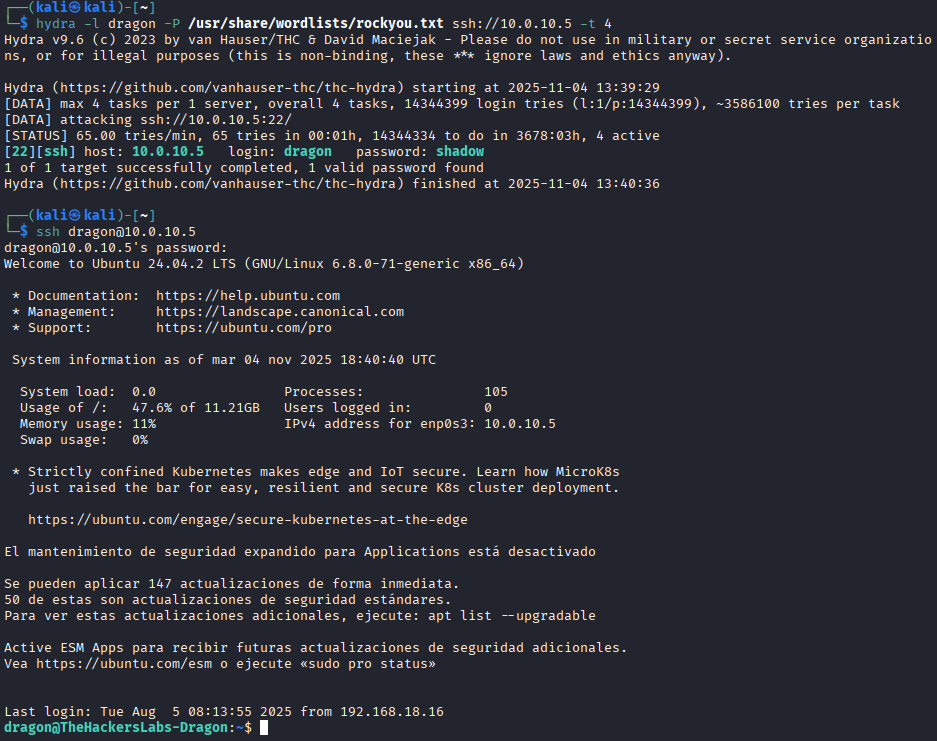
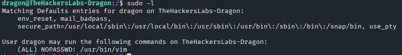
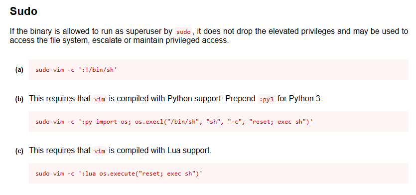
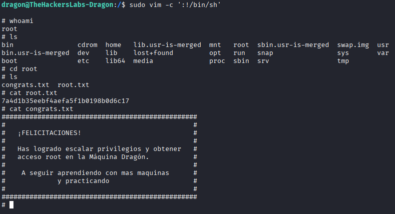

# 🐉 Dragon — Write-Up

**Dificultad:** Fácil  
**Categoría:** CTF / Linux  
**Objetivos:** Capturar `user.txt` y `root.txt`

---

## 📋 Índice

1. [Reconocimiento](#reconocimiento)
2. [Enumeración Web](#enumeración-web)
3. [Acceso inicial — Fuerza bruta SSH](#acceso-inicial--fuerza-bruta-ssh)
4. [Escalada de privilegios](#escalada-de-privilegios)
5. [Flags](#flags)
6. [Conclusiones](#conclusiones)

---

## 🔍 Reconocimiento

Se verifica conectividad con la máquina mediante `ping` y a continuación se lanza un escaneo completo con **Nmap**:

```bash
nmap -A -sV -sC <IP>
```

> 📸 

El escaneo revela dos puertos abiertos:

| Puerto | Servicio | Versión |
|--------|----------|---------|
| 22 | SSH | OpenSSH |
| 80 | HTTP | Apache 2.4.58 |

El `server-header` y el `title` del puerto 80 confirman la versión de Apache 2.4.58, lo que puede ser útil para buscar vulnerabilidades conocidas.

---

## 🌐 Enumeración Web

### Gobuster — Descubrimiento de directorios

Se utiliza **Gobuster** para enumerar directorios y archivos ocultos en el servidor web:

```bash
gobuster dir -u http://<IP>/ -w /usr/share/wordlists/dirb/common.txt -x .php,.txt,.html
```

Parámetros utilizados:

| Parámetro | Descripción |
|-----------|-------------|
| `-u` | URL objetivo |
| `-w` | Wordlist de directorios. Se usa `common.txt` de la carpeta `dirb`, que contiene los nombres de directorios más frecuentes en servidores web |
| `-x` | Extensiones adicionales a probar. Además de buscar directorios, Gobuster probará cada palabra del diccionario añadiéndole estas extensiones — por ejemplo, además de `/admin` probará `/admin.php`, `/admin.txt` y `/admin.html`. Útil para descubrir archivos ocultos además de directorios |

> 📸 

Se descubre el directorio **`/secret`**, que al visitarlo revela una pista clave: el nombre de usuario es **`dragon`**.

---

## 🔑 Acceso inicial — Fuerza bruta SSH

Con el usuario `dragon` identificado, se utiliza **Hydra** para realizar un ataque de fuerza bruta contra el servicio SSH (puerto 22) y obtener la contraseña:

```bash
hydra -l dragon -P /usr/share/wordlists/rockyou.txt ssh://<IP>
```

> 📸 

Con las credenciales obtenidas se accede al sistema:

```bash
ssh dragon@<IP>
```

Una vez dentro, se lista el directorio actual y se obtiene la primera flag:

```bash
ls
cat user.txt
```

✅ **Flag de usuario capturada.**

---

## ⚡ Escalada de privilegios

### Búsqueda de vectores de escalada

Se navega hasta el directorio raíz `/` para explorar la estructura del sistema. Primero se intenta buscar binarios con el bit SUID activado:

```bash
find / -perm -4000 2>/dev/null
```

Este comando busca en todo el sistema archivos con el bit **SUID** activado. Los binarios con SUID se ejecutan con los permisos de su propietario (normalmente root) en lugar de los del usuario que los lanza, lo que los convierte en posibles vectores de escalada de privilegios. El `2>/dev/null` redirige los errores de permisos para que no ensucien la salida.

En esta máquina no se encuentra ninguna vulnerabilidad aprovechable por esta vía, por lo que se comprueba qué comandos puede ejecutar el usuario actual con privilegios de root:

```bash
sudo -l
```

> 📸 

### Explotación con GTFOBins

Se consulta [GTFOBins](https://gtfobins.github.io/) para encontrar el vector de escalada correspondiente al binario identificado en `sudo -l`:

> 📸 

GTFOBins organiza cada binario por contexto de explotación: **Sudo**, **SUID**, **Shell**, etc. Es importante usar la sección correcta porque el comando varía según cómo tengas acceso al binario. En este caso, como lo hemos encontrado con `sudo -l`, usamos la sección **Sudo**. La entrada puede estar al principio o más abajo según el binario, así que hay que desplazarse hasta encontrarla.

Se ejecuta el comando indicado, lo que abre una shell con privilegios de root:

```bash
ls -la /root
cat /root/root.txt
```

> 📸 

✅ **Flag de root capturada.**

---

## 🚩 Flags

| Flag | Estado |
|------|--------|
| `user.txt` | ✅ Capturada |
| `root.txt` | ✅ Capturada |

---

## 📚 Conclusiones

### Herramientas utilizadas

| Herramienta | Propósito |
|-------------|-----------|
| `nmap` | Escaneo de puertos y servicios |
| `gobuster` | Enumeración de directorios y archivos web |
| `hydra` | Fuerza bruta de credenciales SSH |
| `find` | Búsqueda de binarios SUID |
| `sudo -l` + GTFOBins | Escalada de privilegios |

### Lecciones aprendidas

- Los directorios ocultos pueden contener pistas críticas — la enumeración web es siempre un paso esencial.
- Usar `-x` en Gobuster amplía considerablemente la superficie de búsqueda al incluir extensiones de archivo.
- Cuando un nombre de usuario es conocido, la fuerza bruta con Hydra es una vía rápida para obtener acceso.
- Si `find / -perm -4000` no da resultados aprovechables, `sudo -l` es el siguiente paso lógico para escalar privilegios.
- En GTFOBins siempre hay que consultar la sección correcta según el contexto de ejecución (Sudo, SUID, etc.).

---

*Write-up realizado como parte del aprendizaje práctico en CTF.*
